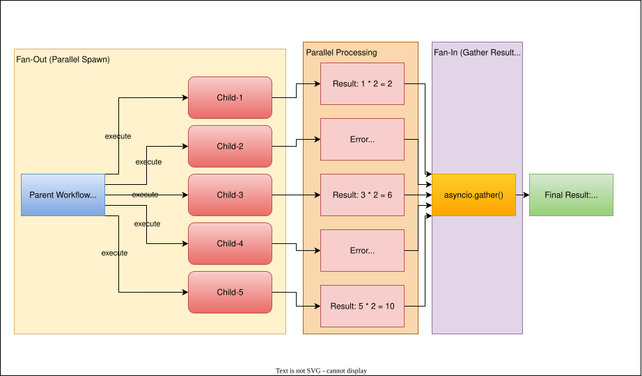

# 🟧 Lab 5: Child Workflows & Parallel Tasks

**Goal:** Compose workflows.

- Define parent and child workflows
- Use `await asyncio.gather(...)` to run children concurrently
- Simulate partial failure and handle gracefully

In this lab, you'll deploy Temporal to AWS so it can be accessed from anywhere. You'll set up the necessary AWS networking, launch an EC2 instance, install Docker and Docker Compose, and then run Temporal using Docker Compose. This is a great way to learn both Temporal and basic AWS cloud deployment!

---

## Prerequisites

Before you begin, make sure you have:

- An AWS Account with configured credentials
- Pulumi CLI installed ([installation guide](https://www.pulumi.com/docs/get-started/install/))
- Python 3.7+ installed
- SSH client (Terminal on macOS/Linux, PuTTY or WSL on Windows)
- AWS CLI installed
- An AWS key pair created in the Singapore region (`ap-southeast-1`)

---

## Setting Up AWS Resources with Pulumi

### 1. Install Pulumi (if not already installed)

```bash
curl -fsSL https://get.pulumi.com | sh
```

### 2. Configure AWS CLI

Configure AWS CLI with the necessary credentials. Run the following command and follow the prompts:

```bash
aws configure
```

You will be prompted for:
- AWS Access Key ID
- AWS Secret Access Key
- Default region name (e.g., `ap-southeast-1`)
- Default output format (e.g., `json`)

Fill in the details using the generated credentials in Poridhi Labs.

### 3. Set Up a Pulumi Project

**Install Python virtual environment:**

```bash
sudo apt update
sudo apt install python3.8-venv
```

**Create a new directory and initialize a Pulumi project:**

```bash
mkdir ssh-lab-pulumi && cd ssh-lab-pulumi
pulumi new aws-python
```

This command creates a new directory with the basic structure for a Pulumi project. Follow the prompts to set up your project:
- Project name: `temporal-lab`
- Project description: `Temporal Lab Infrastructure`
- Stack name: `dev`
- AWS region: `ap-southeast-1`

### 4. Create AWS Key Pair

Create a new key pair for your instances using the following command:

```bash
aws ec2 create-key-pair --key-name MyKeyPair --query 'KeyMaterial' --output text > MyKeyPair.pem
```

Set file permissions of the key file:

```bash
chmod 400 MyKeyPair.pem
```

### 5. Configure Your Infrastructure

Replace the contents of `__main__.py` with the following code:

```python
import pulumi
import pulumi_aws as aws

# Create a VPC
vpc = aws.ec2.Vpc("my-vpc",
   cidr_block="10.0.0.0/16",
   enable_dns_hostnames=True,
   enable_dns_support=True,
   tags={
      "Name": "my-vpc",
   })

# Create a public subnet
public_subnet = aws.ec2.Subnet("my-subnet",
   vpc_id=vpc.id,
   cidr_block="10.0.1.0/24",
   availability_zone="ap-southeast-1a",
   map_public_ip_on_launch=True,
   tags={
      "Name": "my-subnet",
   })

# Create an Internet Gateway
internet_gateway = aws.ec2.InternetGateway("my-igw",
   vpc_id=vpc.id,
   tags={
      "Name": "my-igw",
   })

# Create a Route Table
public_route_table = aws.ec2.RouteTable("my-rt",
   vpc_id=vpc.id,
   tags={
      "Name": "my-rt",
   })

# Create a route in the Route Table for the Internet Gateway
route = aws.ec2.Route("igw-route",
   route_table_id=public_route_table.id,
   destination_cidr_block="0.0.0.0/0",
   gateway_id=internet_gateway.id)

# Associate Route Table with Public Subnet
rt_association = aws.ec2.RouteTableAssociation("rt-association",
   subnet_id=public_subnet.id,
   route_table_id=public_route_table.id)

# Create a Security Group for the SSH Lab Instance
my_security_group = aws.ec2.SecurityGroup("my-secgrp",
   vpc_id=vpc.id,
   description="Allow SSH access",
   ingress=[
    # SSH access from anywhere
    {"protocol": "tcp", "from_port": 22, "to_port": 22, "cidr_blocks": ["0.0.0.0/0"]},
    # Temporal API
    {"protocol": "tcp", "from_port": 7233, "to_port": 7233, "cidr_blocks": ["0.0.0.0/0"]},
    # Temporal Web UI
    {"protocol": "tcp", "from_port": 8233, "to_port": 8233, "cidr_blocks": ["0.0.0.0/0"]}
],
   egress=[
      # Allow all outbound traffic
      {"protocol": "-1", "from_port": 0, "to_port": 0, "cidr_blocks": ["0.0.0.0/0"]}
   ],
   tags={
      "Name": "my-secgrp",
   })

# Define an AMI for the EC2 instance (Ubuntu 24.04 LTS)
ami_id = "ami-01811d4912b4ccb26"  # Ubuntu 24.04 LTS, update if needed for your region

# Create the SSH Lab EC2 Instance
ssh_lab_instance = aws.ec2.Instance("my-instance",
   instance_type="t2.micro",
   vpc_security_group_ids=[my_security_group.id],
   ami=ami_id,
   subnet_id=public_subnet.id,
   key_name="MyKeyPair",
   associate_public_ip_address=True,
   tags={
      "Name": "my-instance",
      "Environment": "Lab",
      "Project": "Temporal-Lab"
   })

# Export the relevant outputs
pulumi.export("vpc_id", vpc.id)
pulumi.export("subnet_id", public_subnet.id)
pulumi.export("security_group_id", my_security_group.id)
pulumi.export("instance_id", ssh_lab_instance.id)
pulumi.export("public_ip", ssh_lab_instance.public_ip)
```

### 6. Deploy the Infrastructure

Deploy the infrastructure:

```bash
pulumi up
```

This will create the necessary resources in AWS. When prompted, select **yes** to confirm the deployment.

**Note:** Remember the public IP address of the instance for later use. You can view it anytime by running:

```bash
pulumi stack output public_ip
```

### 7. Connect to the EC2 Instance

Connect to the EC2 instance using SSH:

```bash
ssh -i MyKeyPair.pem ubuntu@<public_ip>
```

Replace `<public_ip>` with the actual public IP address from the Pulumi output.

---
With your infrastructure in place, you’re ready to take the next step in mastering Temporal. In this lab, you’ll explore parent-child workflow relationships, learning how workflows can coordinate and manage other workflows. This will give you hands-on experience with Temporal’s orchestration capabilities for building complex, reliable systems.


# Lab 5: Child Workflows & Parallel Tasks

**Goal:** Compose workflows using parent and child workflows with parallel execution and graceful failure handling.

## Features
- Define parent and child workflows
- Use `await asyncio.gather(...)` to run children concurrently
- Simulate partial failure and handle gracefully
- Retry policy configuration

## Architectural Point of View


## Quick Start

1. **Start Services:**
   ```bash
   docker-compose up --build
   ```

2. **Run Workflow:**
   ```bash
   docker-compose exec worker python start_workflow.py
   ```

3. **Access Temporal Web UI:**
   Open [http://localhost:8233](http://localhost:8233)

## How it Works
- Parent workflow spawns multiple child workflows in parallel
- Child workflows simulate failures for even numbers
- Parent workflow handles failures gracefully using `asyncio.gather(return_exceptions=True)`
- Failed children are logged but don't stop other children from completing

## 🎯 Learning Objectives

By the end of this lab, you will be able to:
- **Understand workflow composition**: Learn how to break complex business processes into smaller, manageable workflows
- **Implement parent-child relationships**: Create hierarchical workflow structures with proper coordination
- **Execute parallel workflows**: Run multiple child workflows concurrently for improved performance
- **Handle partial failures**: Gracefully manage scenarios where some child workflows fail while others succeed
- **Master error isolation**: Prevent failures in one child workflow from affecting others
- **Design scalable architectures**: Build systems that can handle variable workloads through parallel execution

## Sequence Diagram


## Fam out/ Fan in pattern:
<!--  -->

## 📚 Background

### Why Parent-Child Workflows Matter

Complex business processes often involve **multiple independent tasks** that can be executed in parallel. Parent-child workflows enable you to decompose these processes into smaller, focused workflows while maintaining coordination and error handling at the orchestration level.

### Workflow Composition Benefits

#### Modularity
- **Single Responsibility**: Each child workflow handles one specific task
- **Reusability**: Child workflows can be used by multiple parent workflows
- **Maintainability**: Easier to test, debug, and modify individual components
- **Team Productivity**: Different teams can work on different workflow components

#### Parallel Execution
- **Performance**: Multiple tasks execute simultaneously instead of sequentially
- **Resource Utilization**: Better use of available compute resources
- **Scalability**: Handle larger workloads by distributing work across workflows
- **Responsiveness**: Reduced overall execution time for complex processes

#### Fault Isolation
- **Partial Failures**: Some children can fail without affecting others
- **Error Boundaries**: Failures are contained within child workflows
- **Graceful Degradation**: System continues operating with reduced functionality
- **Independent Retries**: Each child can have its own retry policies

### Real-World Applications

#### E-commerce Order Processing
```
Parent: Order Fulfillment Workflow
├── Child: Inventory Check
├── Child: Payment Processing  
├── Child: Shipping Label Creation
└── Child: Customer Notification
```

#### Data Pipeline Processing
```
Parent: Data Processing Pipeline
├── Child: Data Validation
├── Child: Data Transformation
├── Child: Quality Checks
└── Child: Output Generation
```

#### Microservice Orchestration
```
Parent: Service Deployment Workflow
├── Child: Database Migration
├── Child: Service Update
├── Child: Health Checks
└── Child: Traffic Routing
```

#### Batch Job Processing
```
Parent: Report Generation
├── Child: Sales Data Aggregation
├── Child: Customer Analytics
├── Child: Financial Calculations
└── Child: Report Formatting
```

### Architecture Patterns

#### Fan-Out/Fan-In Pattern
```
┌─────────────┐
│   Parent    │
│  Workflow   │
└─────┬───────┘
      │
      ▼
┌─────────────────────────────┐
│    Parallel Execution      │
├─────────┬─────────┬─────────┤
│ Child 1 │ Child 2 │ Child 3 │
│Workflow │Workflow │Workflow │
└─────────┴─────────┴─────────┘
      │       │       │
      └───────┼───────┘
              ▼
      ┌─────────────┐
      │   Results   │
      │ Aggregation │
      └─────────────┘
```

#### Pipeline Pattern
```
┌─────────┐    ┌─────────┐    ┌─────────┐
│ Child 1 │───►│ Child 2 │───►│ Child 3 │
│Workflow │    │Workflow │    │Workflow │
└─────────┘    └─────────┘    └─────────┘
```

## 🛠 Prerequisites

### Poridhi Lab Environment:
- Completion of **Lab 4** (Signals and Queries)
- Access to Poridhi Lab with VS Code interface
- **Docker & Docker Compose**: ✅ Pre-installed in Poridhi Lab
- **Web Browser**: For accessing Temporal Web UI through load balancer
- **Understanding**: Knowledge of workflows, activities, signals, and queries

### Verify Prerequisites
```bash
# Open VS Code terminal and verify setup
cd lab-5
docker --version
docker-compose --version
```

## 📁 Project Structure

You'll work with the following structure in your lab-5 directory:

```
lab-5/
├── docker-compose.yml                # Temporal server configuration
├── ParentAndChildWorkflow/           # Parent-child workflow implementation
│   ├── Dockerfile                    # Worker container setup
│   ├── parent_and_child_workflow.py # Parent and child workflow definitions
│   ├── worker.py                    # Worker service
│   ├── start_workflow.py            # Workflow starter
│   └── requirements.py             # Python dependencies
└── README.md                        # This documentation
```

## 🚀 Lab Implementation

### Step 1: Set Up Project Structure

Open VS Code terminal in Poridhi Lab and navigate to your lab-5 directory:

```bash
# Navigate to lab-5 directory
cd lab-5

# Verify the ParentAndChildWorkflow directory exists
ls -la ParentAndChildWorkflow/
```

### Step 2: Understand the Docker Configuration

The `docker-compose.yml` should already be configured:

```yaml
version: "3.9"

networks:
  temporal-net:

services:
  # ───────── Postgres (backing store) ─────────
  postgres:
    image: postgres:12-alpine
    container_name: temporal-postgres
    environment:
      - POSTGRES_USER=temporal
      - POSTGRES_PASSWORD=temporal
      - POSTGRES_DB=temporal
    networks: [temporal-net]
    healthcheck:
      test: ["CMD", "pg_isready", "-U", "temporal"]
      interval: 5s
      timeout: 3s
      retries: 10

  # ───────── Temporal Server (auto-setup) ─────
  temporal:
    image: temporalio/auto-setup:1.28.0          # any 1.24+ is fine
    container_name: temporal
    depends_on:
      postgres:
        condition: service_healthy
    environment:
      - DB=postgres12
      - DB_PORT=5432
      - POSTGRES_SEEDS=postgres                 # host of DB container :contentReference[oaicite:0]{index=0}
      - POSTGRES_USER=temporal
      - POSTGRES_PWD=temporal
      - TEMPORAL_CLI_ADDRESS=temporal:7233
    ports:
      - "7233:7233"                              # gRPC / SDK
    networks: [temporal-net]
    healthcheck:
      test: ["CMD-SHELL", "tctl --address temporal:7233 --ns default namespace list >/dev/null 2>&1 || exit 1"]
      interval: 5s
      timeout: 3s
      retries: 10


  # ───────── Temporal Web UI (stand-alone) ────
  temporal-ui:
    image: temporalio/ui:2.39.0                  # latest at time of writing :contentReference[oaicite:1]{index=1}
    container_name: temporal-ui
    depends_on:
      temporal:
        condition: service_healthy
    environment:
      - TEMPORAL_ADDRESS=temporal:7233           # tell UI where the server lives
    ports:
      - "8080:8080"                              # http://localhost:8080
    networks: [temporal-net]

    # ───────── Worker (Python) ───────────────────
  worker:
    build: ./ParentAndChildWorkflow
    volumes:
      - ./ParentAndChildWorkflow:/app
    depends_on:
      temporal:
        condition: service_healthy
    environment:
      - TEMPORAL_ADDRESS=temporal:7233
    command: ["python", "-u", "worker.py"]
    networks: [temporal-net]
```

### Step 3: Examine the Parent-Child Workflow Implementation

The existing `ParentAndChildWorkflow/parent_and_child_workflow.py` demonstrates workflow composition:

```python
from temporalio import workflow
import asyncio
import logging
from temporalio.common import RetryPolicy
from temporalio.exceptions import ApplicationError

# Define the child workflow
@workflow.defn
class ChildWorkflow:
    @workflow.run
    async def run(self, value: int) -> int:
        """
        Child workflow that processes a single value.
        Simulates failures for even numbers to demonstrate error handling.
        """
        # Simulate partial failure for demonstration
        if value % 2 == 0:
            raise ApplicationError(f"Simulated failure for value {value}")
        
        # Process the value (double it)
        result = value * 2
        workflow.logger.info(f"Child workflow processed {value} -> {result}")
        return result

# Define the parent workflow  
@workflow.defn
class ParentWorkflow:
    @workflow.run
    async def run(self, values: list[int]) -> dict:
        """
        Parent workflow that orchestrates multiple child workflows in parallel.
        Demonstrates fan-out/fan-in pattern with graceful error handling.
        """
        workflow.logger.info(f"Parent workflow starting with values: {values}")
        
        results = []
        errors = []
        child_futures = []
        
        # Start all child workflows in parallel (Fan-Out)
        for v in values:
            child_future = workflow.execute_child_workflow(
                ChildWorkflow.run,
                v,
                id=f"child-{v}",  # Unique child workflow ID
                retry_policy=RetryPolicy(maximum_attempts=1)  # Disable retries for demo
            )
            child_futures.append((v, child_future))
        
        # Wait for all child workflows to complete (Fan-In)
        completed = await asyncio.gather(
            *[future for _, future in child_futures], 
            return_exceptions=True  # Don't fail parent if children fail
        )
        
        # Process results and handle failures gracefully
        for idx, (original_value, _) in enumerate(child_futures):
            result = completed[idx]
            
            if isinstance(result, Exception):
                error_info = {
                    "value": original_value,
                    "error": str(result),
                    "type": type(result).__name__
                }
                errors.append(error_info)
                workflow.logger.error(f"Child workflow for value {original_value} failed: {result}")
            else:
                success_info = {
                    "value": original_value,
                    "result": result
                }
                results.append(success_info)
                workflow.logger.info(f"Child workflow for value {original_value} succeeded: {result}")
        
        # Return comprehensive results
        return {
            "total_children": len(values),
            "successful_results": results,
            "failed_children": errors,
            "success_count": len(results),
            "failure_count": len(errors),
            "success_rate": len(results) / len(values) if values else 0
        }
```

#### Key Concepts Demonstrated

| Component | Purpose | Code Pattern |
|-----------|---------|--------------|
| **Child Workflow** | Independent task processor | `@workflow.defn` class with single responsibility |
| **Parent Workflow** | Orchestrator and coordinator | Uses `execute_child_workflow()` for child spawning |
| **Parallel Execution** | Concurrent processing | `asyncio.gather()` for simultaneous execution |
| **Error Isolation** | Graceful failure handling | `return_exceptions=True` prevents cascading failures |
| **Unique Child IDs** | Child workflow identification | `id=f"child-{v}"` for tracking individual children |
| **Retry Policies** | Per-child error handling | Individual retry configurations for each child |

### Step 4: Examine the Worker Service

The `ParentAndChildWorkflow/worker.py` registers both parent and child workflows:

```python
import asyncio
from temporalio.client import Client
from temporalio.worker import Worker

# Import both parent and child workflows
from parent_and_child_workflow import ParentWorkflow, ChildWorkflow

async def main():
    """Worker that processes both parent and child workflows."""
    
    # Connect to Temporal server
    client = await Client.connect("temporal:7233", namespace="default")
    
    # Create worker with both workflow types
    worker = Worker(
        client,
        task_queue="parent-and-child-task-queue",
        workflows=[ParentWorkflow, ChildWorkflow],  # Register both workflow types
    )
    
    print("🔄 Parent-Child Workflow Worker started!")
    print("📋 Listening on task queue: parent-and-child-task-queue")
    print("🎯 Ready to process parent and child workflows...")
    await worker.run()

if __name__ == "__main__":
    asyncio.run(main())
```

### Step 5: Deploy and Configure Load Balancer

```bash
# Build and start services
docker-compose up --build -d

# Verify containers are running
docker-compose ps

# Check worker logs
docker-compose logs -f worker
```

## Run `make up` and observer the terminal output


#### Configure Load Balancer
1. Get your lab instance IP: `ifconfig eth0`
2. **Create Load Balancer** in Poridhi Lab interface:
   - **Enter IP**: Your lab instance eth0 IP address
   - **Enter Port**: `8233`
3. **Click Create**

### Step 6: Execute Parent-Child Workflow

```bash
# Start the parent workflow with child processes
docker-compose exec worker python start_workflow.py
```

The parent workflow will start and you should see output like:
```
🚀 Starting ParentWorkflow with values: [1, 2, 3, 4, 5]
📋 Workflow ID: parent-child-workflow-1703845200
✅ Parent workflow started successfully!
Child workflow processed 1 -> 2
Child workflow for value 2 failed: Simulated failure for value 2
Child workflow processed 3 -> 6
Child workflow for value 4 failed: Simulated failure for value 4
Child workflow processed 5 -> 10
```

**Important**: Note the **Workflow ID** for monitoring in the Web UI!

### Step 7: Monitor in Web UI

1. **Open Temporal Web UI**: Use your load balancer URL
2. **Navigate to Workflows**: Click "Workflows" in sidebar
3. **Find Parent Workflow**: Look for ParentWorkflow
4. **Observe the Execution**: The parent should show as "Completed"

#### What to Look For in Web UI


##### Parent Workflow View
- **Status**: Completed (green checkmark)
- **Duration**: Total execution time
- **Child Workflows**: Links to individual child executions

## Event History


##### Child Workflow Views
- **Successful Children**: Show as "Completed" 
- **Failed Children**: Show as "Failed" with error details
- **Parallel Execution**: All children start around the same time

#### Workflow Hierarchy Navigation
1. **Click on Parent Workflow** to see execution details
2. **Look for Child Workflow Events** in the timeline
3. **Click on Individual Child Links** to see their execution details
4. **Compare Timing** to verify parallel execution

### Step 8: Analyze Results and Patterns

#### Expected Behavior
Based on the failure simulation (even numbers fail):
- **Input**: `[1, 2, 3, 4, 5]`
- **Successful**: `[1, 3, 5]` → Results: `[2, 6, 10]`
- **Failed**: `[2, 4]` → Errors logged and handled gracefully

#### Result Structure
```json
{
  "total_children": 5,
  "successful_results": [
    {"value": 1, "result": 2},
    {"value": 3, "result": 6},
    {"value": 5, "result": 10}
  ],
  "failed_children": [
    {"value": 2, "error": "Simulated failure for value 2", "type": "ApplicationError"},
    {"value": 4, "error": "Simulated failure for value 4", "type": "ApplicationError"}
  ],
  "success_count": 3,
  "failure_count": 2,
  "success_rate": 0.6
}
```

### Step 9: Run Different Scenarios

#### Scenario 1: All Success (Odd Numbers Only)
```bash
# Start workflow with only odd numbers
docker-compose exec temporal temporal workflow start \
  --task-queue parent-and-child-task-queue \
  --type ParentWorkflow \
  --input '[1, 3, 5, 7, 9]' \
  --workflow-id parent-all-success \
  --namespace default
```

#### Scenario 2: All Failures (Even Numbers Only)
```bash
# Start workflow with only even numbers
docker-compose exec temporal temporal workflow start \
  --task-queue parent-and-child-task-queue \
  --type ParentWorkflow \
  --input '[2, 4, 6, 8]' \
  --workflow-id parent-all-failures \
  --namespace default
```

#### Scenario 3: Large Scale Processing
```bash
# Start workflow with many values
docker-compose exec temporal temporal workflow start \
  --task-queue parent-and-child-task-queue \
  --type ParentWorkflow \
  --input '[1, 2, 3, 4, 5, 6, 7, 8, 9, 10, 11, 12, 13, 14, 15]' \
  --workflow-id parent-large-scale \
  --namespace default
```

## 🔍 Understanding Parent-Child Patterns

### Parallel Execution Analysis

#### Performance Benefits
- **Concurrent Processing**: All children start simultaneously
- **Reduced Latency**: Total time ≈ slowest child (not sum of all children)
- **Resource Utilization**: Multiple workers can process children simultaneously
- **Scalability**: Can handle variable workloads efficiently

#### Execution Timeline
```
Parent Start    ├─Child 1 Start ────── Child 1 Complete
                ├─Child 2 Start ──X── Child 2 Failed
                ├─Child 3 Start ────── Child 3 Complete
                ├─Child 4 Start ──X── Child 4 Failed
                └─Child 5 Start ────── Child 5 Complete
                                    │
Parent Complete ←─────────────────────┘
```

### Error Handling Strategies

#### Graceful Degradation
- **Partial Success**: System continues with available results
- **Error Reporting**: Failed children are logged and reported
- **No Cascading Failures**: One child failure doesn't stop others
- **Configurable Retries**: Each child can have different retry policies

#### Error Isolation Techniques

| Technique | Implementation | Benefits |
|-----------|----------------|----------|
| **Exception Catching** | `return_exceptions=True` | Prevents parent failure |
| **Individual Try-Catch** | Per-child error handling | Fine-grained control |
| **Retry Policies** | Child-specific retry configuration | Failure resilience |
| **Compensation Logic** | Rollback failed operations | Data consistency |

## 🧪 Experimentation

### Try These Variations

#### 1. Modify Failure Conditions
Edit `parent_and_child_workflow.py`:
```python
# Different failure condition
if value % 3 == 0:  # Fail multiples of 3
    raise ApplicationError(f"Simulated failure for value {value}")

# Random failures
import random
if random.random() < 0.3:  # 30% failure rate
    raise ApplicationError(f"Random failure for value {value}")
```

#### 2. Add Processing Delays
```python
@workflow.run
async def run(self, value: int) -> int:
    # Simulate processing time
    import random
    delay = random.uniform(1, 5)  # 1-5 second delay
    await workflow.sleep(timedelta(seconds=delay))
    
    # ... rest of processing
```

#### 3. Implement Different Child Types
```python
@workflow.defn
class DataValidationWorkflow:
    @workflow.run
    async def run(self, data: dict) -> bool:
        # Validate data structure
        return "name" in data and "email" in data

@workflow.defn  
class DataTransformationWorkflow:
    @workflow.run
    async def run(self, data: dict) -> dict:
        # Transform data format
        return {
            "full_name": data.get("name", "").upper(),
            "email_domain": data.get("email", "").split("@")[-1]
        }
```

#### 4. Add Dynamic Child Spawning
```python
@workflow.run
async def run(self, batch_size: int, total_items: int) -> dict:
    """Dynamically create children based on batch size."""
    
    child_futures = []
    for batch_start in range(0, total_items, batch_size):
        batch_end = min(batch_start + batch_size, total_items)
        batch_data = list(range(batch_start, batch_end))
        
        child_future = workflow.execute_child_workflow(
            BatchProcessingWorkflow.run,
            batch_data,
            id=f"batch-{batch_start}-{batch_end}"
        )
        child_futures.append(child_future)
    
    # Process all batches
    results = await asyncio.gather(*child_futures, return_exceptions=True)
    return {"batches_processed": len(results), "results": results}
```

### Performance Testing

#### Measure Parallel vs Sequential Performance
```python
import time

# Sequential execution (for comparison)
@workflow.run
async def run_sequential(self, values: list[int]) -> dict:
    results = []
    start_time = time.time()
    
    for v in values:
        try:
            result = await workflow.execute_child_workflow(
                ChildWorkflow.run, v, id=f"seq-child-{v}"
            )
            results.append({"value": v, "result": result})
        except Exception as e:
            results.append({"value": v, "error": str(e)})
    
    return {
        "results": results,
        "execution_time": time.time() - start_time,
        "execution_type": "sequential"
    }
```

## 🔧 Troubleshooting

### Common Issues

#### Child Workflows Not Starting
```bash
# Check if both workflow types are registered
docker-compose logs worker | grep -i "workflow"

# Verify task queue configuration
docker-compose exec temporal temporal task-queue describe \
  --task-queue parent-and-child-task-queue \
  --namespace default
```

#### Parent Workflow Failing on Child Errors
```bash
# Check error handling in parent workflow
docker-compose logs worker | grep -i "error"

# Verify return_exceptions=True is used
grep -n "return_exceptions" ParentAndChildWorkflow/parent_and_child_workflow.py
```

#### Child Workflows Not Visible in Web UI
```bash
# Check child workflow IDs are unique
docker-compose exec temporal temporal workflow list \
  --namespace default | grep child-
```

#### Worker Overload
```bash
# Monitor worker performance
docker-compose exec worker top

# Check for too many concurrent children
docker-compose logs worker | grep -c "Child workflow"
```

## 🧹 Cleanup

```bash
# Stop all workflows
docker-compose exec temporal temporal workflow terminate \
  --workflow-id parent-child-workflow-1703845200 \
  --reason "Lab completed" \
  --namespace default

# Stop all services
docker-compose down

# Clean up resources
docker-compose down -v
docker system prune -a
```

**Remove Load Balancer**: Delete the load balancer configuration in Poridhi Lab interface.

## 🎓 Key Takeaways

- **Workflow Composition** enables building complex systems from simple, focused components
- **Parallel Execution** dramatically improves performance for independent tasks
- **Error Isolation** prevents failures in one component from affecting others
- **Graceful Degradation** allows systems to continue operating with partial functionality
- **Fan-Out/Fan-In Patterns** are essential for scalable workflow architectures
- **Child Workflow Management** requires careful consideration of IDs, retry policies, and error handling
- **Monitoring and Observability** become critical in distributed workflow systems

## 🚀 Next Steps

- **Advanced Patterns**: Implement conditional child workflows and dynamic scaling
- **Integration Testing**: Test parent-child workflows with real external services
- **Performance Optimization**: Tune batch sizes and concurrency limits
- **Production Deployment**: Add comprehensive monitoring and alerting
- **Error Recovery**: Implement compensation patterns and manual intervention capabilities

## 📚 Additional Resources

- [Temporal Child Workflows](https://docs.temporal.io/concepts/what-is-a-child-workflow)
- [Workflow Composition Patterns](https://docs.temporal.io/application-development/foundations#child-workflows)
- [Parallel Processing Best Practices](https://docs.temporal.io/application-development/foundations#parallel-activity-execution)
- [Error Handling in Distributed Workflows](https://docs.temporal.io/application-development/foundations#workflow-retries)

