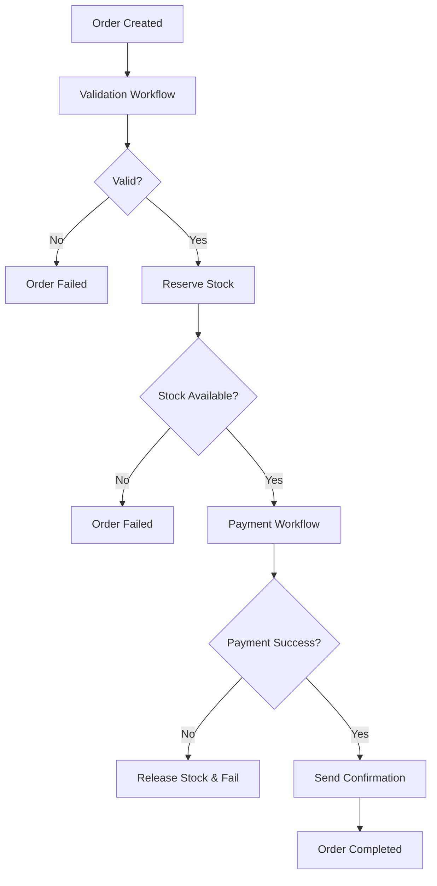

# Lab 8: Real-World Order Processing System

A complete, production-ready order processing system built with Temporal, demonstrating real-world workflow orchestration patterns, child workflows, and compensation logic.

## 🎯 Learning Objectives

By the end of this lab, you will be able to:

- **Build complex workflow orchestration** using parent and child workflows
- **Implement business logic** with activities for validation, payment, and inventory management
- **Handle failures gracefully** with compensation patterns and error isolation
- **Integrate with databases** using PostgreSQL for persistent storage
- **Create REST APIs** that interact with Temporal workflows
- **Design modular systems** with clear separation of concerns
- **Practice production patterns** including retries, timeouts, and monitoring

## 🏗️ System Architecture

```
┌─────────────┐     ┌─────────────┐     ┌─────────────┐
│   FastAPI   │────▶│  Temporal   │────▶│   Worker    │
│   (API)     │     │   Server    │     │  (Process)  │
└─────────────┘     └─────────────┘     └─────────────┘
       │                    │                    │
       └────────────────────┴────────────────────┘
                            │
                      ┌─────────────┐
                      │ PostgreSQL  │
                      │ (Database)  │
                      └─────────────┘
```

### Components Overview

| Component | Purpose | Technology |
|-----------|---------|------------|
| **FastAPI Service** | REST API for order management | FastAPI, Python |
| **Temporal Server** | Workflow orchestration engine | Temporal |
| **Order Worker** | Processes workflows and activities | Python, Temporal SDK |
| **PostgreSQL** | Persistent data storage | PostgreSQL |
| **Temporal Web UI** | Workflow monitoring and debugging | Temporal UI |

## 📁 Project Structure

```
lab-8/
├── docker-compose.yml          # Multi-service orchestration
├── postgres-init/
│   └── init.sql               # Database schema and sample data
├── order-service/             # Temporal worker service
│   ├── models/
│   │   └── order_models.py    # Data models and enums
│   ├── workflows/
│   │   ├── order_workflow.py  # Main order processing workflow
│   │   └── child_workflows.py # Validation and payment workflows
│   ├── activities/
│   │   ├── validation_activity.py    # Order validation logic
│   │   ├── inventory_activity.py     # Stock management
│   │   ├── payment_activity.py       # Payment processing
│   │   └── notification_activity.py  # Email confirmations
│   ├── worker.py              # Temporal worker registration
│   ├── start_workflow.py      # Test workflow starter
│   ├── Dockerfile
│   └── requirements.txt
├── api-service/               # REST API service
│   ├── main.py               # FastAPI application
│   ├── database.py           # Database utilities
│   ├── Dockerfile
│   └── requirements.txt
└── README.md                 # This documentation
```

## 🚀 Quick Start

### Prerequisites

- Docker and Docker Compose installed
- Basic understanding of Python and APIs
- Familiarity with database concepts

### 1. Start All Services

```bash
# Navigate to lab directory
cd lab-8

# Start all containers
docker-compose up --build

# Wait for all services to be healthy (this may take 2-3 minutes)
docker-compose ps
```

You should see all containers running:
```
NAME                COMMAND                STATUS         PORTS
order-api          "uvicorn main:app..."   Up            0.0.0.0:8000->8000/tcp
order-worker       "python -u worker.py"   Up            
temporal           "/entrypoint.sh..."     Up (healthy)  0.0.0.0:7233->7233/tcp
temporal-postgres  "docker-entrypoint..."  Up (healthy)  
temporal-ui        "/docker-entrypoint..."  Up            0.0.0.0:8080->8080/tcp
```

### 2. Access Services

Once all services are running, you can access:

- **Order API**: http://localhost:8000
- **API Documentation**: http://localhost:8000/docs (Interactive Swagger UI)
- **Temporal Web UI**: http://localhost:8080

## 📋 Order Processing Workflow

### Step-by-Step Process



### 1. **Order Validation** (Child Workflow)
- Checks product existence in inventory
- Validates requested quantities against available stock
- Verifies price consistency
- Returns detailed validation results

### 2. **Stock Reservation** (Activity)
- Atomically reserves inventory using database transactions
- Creates time-limited reservations (15 minutes)
- Prevents overselling through optimistic locking
- Tracks reservation IDs for later release

### 3. **Payment Processing** (Child Workflow)
- Simulates payment gateway integration
- Implements retry logic for transient failures
- Handles different failure scenarios (e.g., insufficient funds, gateway errors)
- Returns transaction ID on success

### 4. **Order Confirmation** (Activity)
- Generates unique confirmation number
- Simulates email sending to customer
- Logs confirmation details
- Updates order status to confirmed

### 5. **Compensation Logic**
If any step fails after stock reservation:
- Automatically releases reserved inventory
- Updates stock quantities in database
- Marks reservations as released
- Prevents inventory leakage

## 🧪 Testing the System

### Test 1: Check Available Inventory

```bash
curl http://localhost:8000/inventory
```

Expected response:
```json
{
  "inventory": [
    {
      "product_id": "LAPTOP-001",
      "product_name": "Gaming Laptop",
      "available_quantity": 10,
      "reserved_quantity": 0,
      "price": 1299.99
    },
    ...
  ]
}
```

### Test 2: Create a Successful Order

```bash
curl -X POST http://localhost:8000/orders \
  -H "Content-Type: application/json" \
  -d '{
    "customer_email": "customer@example.com",
    "items": [
      {"product_id": "LAPTOP-001", "quantity": 1},
      {"product_id": "MOUSE-001", "quantity": 2}
    ]
  }'
```

Expected response:
```json
{
  "order_id": "order-abc123def456",
  "workflow_id": "order-workflow-order-abc123def456",
  "status": "processing",
  "total_amount": 1399.97,
  "message": "Order created and processing started",
  "tracking_url": "/orders/order-abc123def456"
}
```

### Test 3: Check Order Status

```bash
curl http://localhost:8000/orders/{order_id}
```

Replace `{order_id}` with the actual order ID from the previous step.

### Test 4: Create Order with Insufficient Stock

```bash
curl -X POST http://localhost:8000/orders \
  -H "Content-Type: application/json" \
  -d '{
    "customer_email": "customer@example.com",
    "items": [
      {"product_id": "LAPTOP-001", "quantity": 100}
    ]
  }'
```

This should trigger validation failure due to insufficient stock.

### Test 5: Test Using the Worker Script

```bash
# Run the test workflow directly
docker-compose exec worker python start_workflow.py
```

This starts a test order workflow and shows the complete execution flow.

## 📊 Monitoring with Temporal Web UI

### 1. Access the Web UI
Open http://localhost:8080 in your browser.

### 2. Navigate to Workflows
Click "Workflows" in the left sidebar to see all running and completed workflows.

### 3. Explore Order Workflows
- Look for workflows with IDs starting with `order-workflow-`
- Click on any workflow to see detailed execution history
- Observe the timeline of activities and child workflows

### 4. View Child Workflows
- In the main order workflow, look for "Child Workflow Started" events
- Click on child workflow links to see validation and payment details
- Compare execution times to understand parallel processing

### 5. Analyze Failures
- Create orders that trigger failures (invalid products, insufficient stock)
- Observe how compensation logic automatically releases stock
- See retry attempts and error handling in action

## 🔧 Key Features Demonstrated

### 1. **Workflow Orchestration**
- **Parent-Child Relationships**: Main workflow coordinates child workflows
- **Activity Coordination**: Sequential and parallel activity execution
- **State Management**: Workflow maintains order status throughout process

### 2. **Error Handling & Compensation**
- **Graceful Degradation**: System continues functioning with partial failures
- **Automatic Compensation**: Stock automatically released on payment failure
- **Error Isolation**: Child workflow failures don't crash parent workflow

### 3. **Retry Policies**
- **Configurable Retries**: Different retry settings for different operations
- **Exponential Backoff**: Intelligent retry spacing to avoid overwhelming services
- **Non-Retryable Errors**: Some errors (like card declined) don't retry

### 4. **Database Integration**
- **ACID Transactions**: Atomic stock reservations prevent race conditions
- **Connection Pooling**: Efficient database connection management
- **Schema Design**: Proper relationships and constraints

### 5. **Production Patterns**
- **Health Checks**: Services provide health status endpoints
- **Logging**: Comprehensive logging throughout the system
- **Configuration**: Environment-based configuration
- **Documentation**: API documentation with Swagger/OpenAPI

## 🛠️ Development and Customization

### Adding New Products

```sql
-- Connect to the database and add products
INSERT INTO order_system.inventory (product_id, product_name, available_quantity, price) 
VALUES ('TABLET-001', 'Android Tablet', 20, 299.99);
```

### Modifying Payment Success Rate

Edit `order-service/activities/payment_activity.py`:
```python
# Change success rate from 80% to 90%
if random.random() < 0.9:  # Changed from 0.8
```

### Adding New Validation Rules

Edit `order-service/activities/validation_activity.py` to add business rules:
```python
# Example: Minimum order amount
if order.total_amount < 50.0:
    errors.append("Minimum order amount is $50")
```

### Extending Notification Methods

Edit `order-service/activities/notification_activity.py`:
```python
# Add SMS notification
def send_sms_notification(order):
    # Implementation for SMS service
    pass
```

## 🧹 Cleanup

### Stop All Services
```bash
docker-compose down
```

### Remove Volumes (Optional)
```bash
docker-compose down -v
```

### Clean Up Docker Resources
```bash
docker system prune -a
```

## 🔍 Troubleshooting

### Common Issues

#### Services Not Starting
```bash
# Check service logs
docker-compose logs temporal
docker-compose logs worker
docker-compose logs api

# Verify all services are healthy
docker-compose ps
```

#### Database Connection Issues
```bash
# Check PostgreSQL logs
docker-compose logs postgres

# Verify database connectivity
docker-compose exec postgres psql -U temporal -d temporal -c "SELECT 1;"
```

#### Workflow Not Processing
```bash
# Check worker logs
docker-compose logs -f worker

# Verify worker registration
docker-compose exec worker python -c "print('Worker is running')"
```

#### API Errors
```bash
# Check API logs
docker-compose logs -f api

# Test API health
curl http://localhost:8000/health
```

### Getting Help

1. **Check Logs**: Always start by examining service logs
2. **Temporal Web UI**: Use the web interface to debug workflows
3. **Database State**: Check database tables for data consistency
4. **Network Issues**: Ensure all containers can communicate

## 🎓 Key Takeaways

### Technical Skills Learned
- **Workflow Orchestration**: Building complex multi-step processes
- **Child Workflows**: Decomposing workflows for modularity and reusability
- **Error Handling**: Implementing robust error handling and compensation logic
- **Database Integration**: Working with persistent storage in workflow systems
- **API Development**: Creating REST APIs that integrate with workflow engines

### Production Concepts
- **Observability**: Monitoring and debugging distributed systems
- **Reliability**: Building systems that handle failures gracefully
- **Scalability**: Designing systems that can handle varying loads
- **Maintainability**: Creating modular, testable code

### Business Value
- **Process Automation**: Automating complex business workflows
- **Consistency**: Ensuring reliable execution of business rules
- **Auditability**: Maintaining complete records of all operations
- **Customer Experience**: Providing reliable and transparent order processing

## 🚀 Next Steps

### Advanced Features to Explore
1. **Dynamic Workflows**: Conditional logic and dynamic child workflow creation
2. **Saga Patterns**: Long-running transactions with complex compensation
3. **Event-Driven Architecture**: Integrating with external event sources
4. **Performance Optimization**: Scaling workers and optimizing database queries

### Production Deployment
1. **Container Orchestration**: Deploy with Kubernetes
2. **Monitoring**: Add Prometheus metrics and alerting
3. **Security**: Implement authentication and authorization
4. **High Availability**: Configure for zero-downtime deployments

### Integration Opportunities
1. **Payment Gateways**: Integrate with real payment providers (Stripe, PayPal)
2. **Email Services**: Connect with email providers (SendGrid, AWS SES)
3. **Inventory Systems**: Integrate with external inventory management
4. **Shipping Services**: Add shipping and tracking functionality

## 📚 Additional Resources

- [Temporal Documentation](https://docs.temporal.io/)
- [FastAPI Documentation](https://fastapi.tiangolo.com/)
- [PostgreSQL Documentation](https://www.postgresql.org/docs/)
- [Docker Compose Documentation](https://docs.docker.com/compose/)

---

**Congratulations!** 🎉 You've successfully built a complete order processing system using Temporal. This lab demonstrates real-world patterns and practices used in production systems. The modular design, comprehensive error handling, and monitoring capabilities make this a solid foundation for building scalable workflow-based applications. 